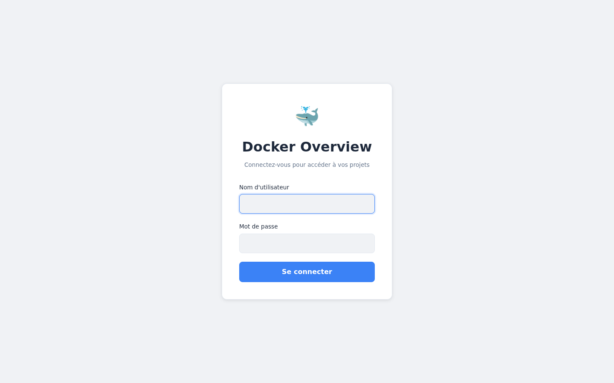

# Docker Overview WebUI

A web dashboard to monitor and operate your Docker Compose projects from one place — interactive topology, live metrics, anomaly alerts, streaming logs, and one-click service lifecycle control.



## Who it's for

Developers and operators running several Docker Compose stacks on a single host who want a visual cockpit instead of juggling `docker compose ps/logs/restart` across directories. It reads the host Docker socket (read-only) and auto-discovers every Compose project under a directory you mount.

## Features

- **Project overview** — auto-discovers and lists every Compose project found in the mounted projects directory.
- **Interactive topology** — graph of a project's services and networks, rendered with React Flow.
- **Live metrics** — per-container CPU, memory, and network usage, charted in real time.
- **Anomaly alerts** — automatically surfaces containers that are exited, restarting, or unhealthy.
- **Service lifecycle** — start / stop / restart / pause / unpause any service straight from the UI.
- **Streaming logs** — tail a service's logs live in an in-browser terminal (xterm.js over WebSocket).
- **Authentication** — JWT Bearer with a built-in local admin and optional LDAP.

## Screenshots


## Tech stack

- **Backend** — FastAPI (Python 3.12), pydantic-settings, talks to Docker via the host socket.
- **Frontend** — React 19 + TypeScript, Vite 8, TanStack Query, React Router 7, React Flow, Recharts, xterm.js.
- **Packaging** — Docker Compose (production, dev, test, and e2e profiles).

## Prerequisites

- Docker >= 24 and Docker Compose >= 2.20
- GNU Make
- A local directory containing your Compose project sub-folders

## Quick start

```bash
# 1. Clone
git clone git@github.com:chrysa/container-webview.git
cd container-webview

# 2. Configure
cp .env.example .env
# Edit .env: SECRET_KEY, ADMIN_USERNAME, ADMIN_PASSWORD, PROJECTS_PATH

# 3. Point PROJECTS_PATH at the directory holding your Compose projects
#    (defaults to /opt/projects)

# 4. Start the production stack
make prod-up          # or: docker compose up --detach --wait
```

Then open:

- **UI**: http://localhost:9103
- **API docs (Swagger)**: http://localhost:9003/docs

Default credentials if none are configured: `admin` / `admin` (change them).

### Development mode (hot reload)

```bash
make dev-up           # Vite frontend on :5173, API on :8000 (--reload)
```

## Configuration

All variables are documented in [.env.example](.env.example).

| Variable | Default | Description |
|---|---|---|
| `SECRET_KEY` | `change-me-in-production` | JWT signing key — **change in production** |
| `ADMIN_USERNAME` | `admin` | Local admin username |
| `ADMIN_PASSWORD` | `admin` | Local admin password — **change in production** |
| `PROJECTS_PATH` | `/opt/projects` | Host directory containing your Compose projects (mounted read-only at `/projects`) |
| `LDAP_SERVER` | _(empty)_ | LDAP URL (`ldap://host:389`) — empty disables LDAP |
| `LDAP_BASE_DN` | _(empty)_ | LDAP base DN |
| `VITE_API_URL` | `http://localhost:9003` | API URL as seen by the browser, baked at build time. Leave empty if a reverse proxy serves `/api`. |
| `SENTRY_DSN` | _(empty)_ | Optional Sentry DSN for backend error reporting |

The Compose stack mounts `${PROJECTS_PATH}:/projects:ro` and `/var/run/docker.sock` (read-only) into the API container.

### Ports

| Service | Host port | Notes |
|---|---|---|
| Frontend (production) | `9103` | `make prod-up` |
| API (production) | `9003` | Swagger at `9003/docs` |
| Frontend (dev, Vite) | `5173` | `make dev-up` |
| API (dev) | `8000` | `make dev-up` |

## API endpoints

Interactive docs at `http://localhost:9003/docs` (Swagger UI).

| Method | Path | Description |
|---|---|---|
| `GET` | `/api` | Health/ping |
| `POST` | `/api/auth/login` | Authenticate — returns a JWT Bearer token |
| `GET` | `/api/auth/check` | Validate the current token |
| `GET` | `/api/projects` | List all discovered Compose projects |
| `GET` | `/api/projects/{id}` | Project detail |
| `GET` | `/api/projects/{id}/topology` | Topology graph for a project |
| `GET` | `/api/projects/{id}/metrics` | CPU / memory / network metrics for the project's containers |
| `POST` | `/api/projects/{id}/services/{svc}/start` | Start a service |
| `POST` | `/api/projects/{id}/services/{svc}/stop` | Stop a service |
| `POST` | `/api/projects/{id}/services/{svc}/restart` | Restart a service |
| `POST` | `/api/projects/{id}/services/{svc}/pause` | Pause a service |
| `POST` | `/api/projects/{id}/services/{svc}/unpause` | Unpause a service |
| `GET` | `/api/alerts` | All active alerts |
| `WS` | `/api/projects/{id}/services/{svc}/logs` | Stream service logs (WebSocket) |

## Make commands

```bash
make help              # List all available targets

# Lifecycle
make prod-up           # Start production stack (detached, waits for health)
make prod-down         # Stop production stack
make dev-up            # Dev mode: Vite (5173) + API (8000)
make docker-build      # Build production images
make docker-logs SERVICE=api   # Tail a service's logs

# Quality (backend)
make api-tests         # Run backend tests
make api-tests-cov     # Tests + terminal coverage report
make api-tests-html    # Tests + HTML coverage report (htmlcov/)
make api-lint          # Ruff linter
make api-format        # Ruff formatter
make api-typecheck     # mypy

# Quality (frontend)
make node-test         # Vitest unit tests
make node-lint         # ESLint
make node-build        # Production build

make pre-commit        # Run all pre-commit hooks
```

## Tests

Backend tests use **pytest** (coverage target enforced via the quality gate). Frontend uses **Vitest**; end-to-end tests use **Playwright** (`docker compose --profile e2e up`).

```bash
make api-tests         # backend
make node-test         # frontend
```

## Documentation

- [.env.example](.env.example) — all configuration variables
- [CHANGELOG.md](CHANGELOG.md) — release history (auto-generated via git cliff)
- [DECISIONS.md](DECISIONS.md) — architecture decisions
- API reference — Swagger UI at `http://localhost:9003/docs`

## Roadmap

- [ ] Manage projects/services (create, edit) from the UI
- [ ] Export docker-compose (global, per-service, dev/prod)
- [ ] Browser notifications on container state changes
- [ ] Multi-user authentication
- [ ] Docker Desktop extension

## License

See repository for license details.
</content>
</invoke>
